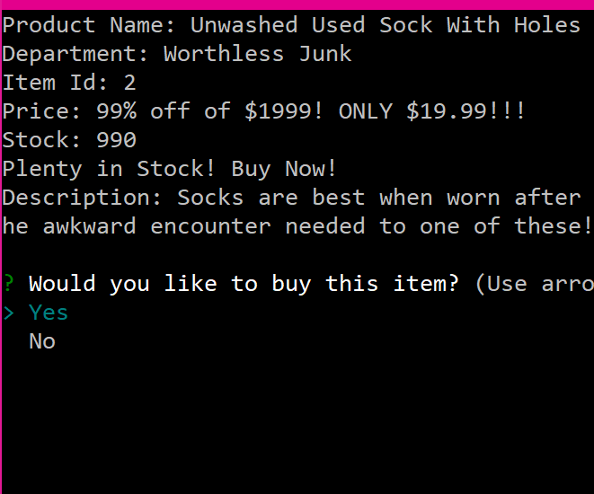

# Node.js Bamazon

Pretend-Buy Stuff From Bamazon!

### **IMPORTANT Instructions:**

- Set up the database with schema.sql
- Set up some seed data with seed.sql
- Make sure you have node installed
- Check your local machine's sql info in bamazon.js and bamazonManager.js
- `node bamazon.js` for customer experience
- `node bamazonManager.js` for manager experience

***Much Needed Improvements:***
- Everything
- Additional 'master' commands

**Never Forget:**

> `npm i`

**Node Packages Used**

mysql | inquirer
-------- | -------------
[mysql](https://www.npmjs.com/package/mysql) | [inquirer](https://www.npmjs.com/package/inquirer)
Uses mysql to query data | Used to inquire to navigate through bamazon